# GraphQL学习笔记

[TOC]

## 1. 简介

GraphQL是一个新的API标准，相对于REST它更高效和灵活。它最初是Facebook的开源项目，现在由社区进行驱动。

GraphQL的核心是启用声明式数据获取，客户端可以精确指定其需要从API中获取哪些数据。GraphQL服务器不使用多个返回固定数据结构的endpoints，而仅公开一个endpoint并准确响应客户端要求的数据。（*这句话的理解方式后面再补充*）

### 1.1 GraphQL是一种API查询语言

对于大多数应用来说，它们需要从服务端获取存储在数据库中的数据。API的责任是对数据提供一个接口来满足应用程序的需要。

GraphQL通常被误认为是一直数据库技术，这是一种错误的认识，它是一种API查询语言，而不是数据库。从这种以用上来说，它和数据库无关，它可以在使用API任何情况下使用。

### 1.2 它是REST的一种更有效的替代

REST在当前环境下需要面对的问题：

1. 移动应用使用量的增加导致更加有效加载数据的需求
2. 各种不同的前端框架和平台对API提出了挑战。同一个API很难适合各种不同前端的需求。
3. 快速开发和对快速开发功能的期望。快速的迭代和频繁的产品更新是必不可少的。它经常需要修改服务器对外暴露的数据，并要求客户端做修改。这阻碍了快速开发实践和产品的迭代。

### 1.3 GraphQL比REST更优秀

#### 数据的获取方式REST和GraphQL比较

使用REST API，你通常需要多次请求来收集数据，如下面的例子：

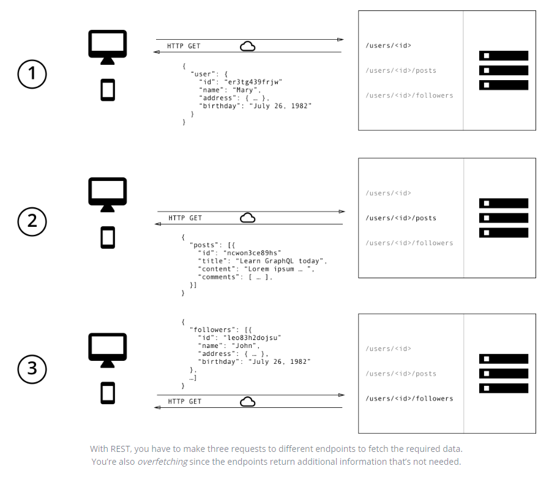

使用GraphQL，你只需要向服务器发一次包含具体数据要求的查询即可。然后，服务器将会返回满足这些要求的JSON对象。

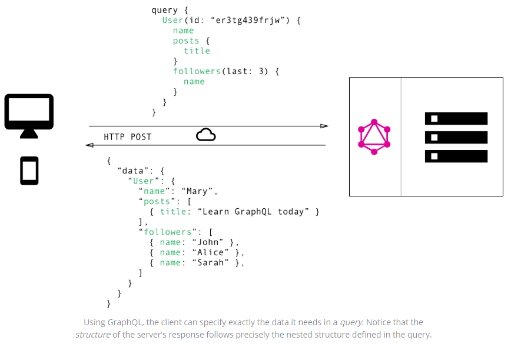

#### 不再需要过度获取和获取不足

REST最常见的问题之一是过度获取或者获取不足（例如上面举的例子）。发生这种情况的原因是，客户端下载数据的唯一方法是通过命中endpoints（即访问不同的API endpoints）返回固定的数据结构。以能够为客户提供确切数据需求的方式设计API是非常困难的。

##### 过度获取：下载多余的数据

指的是客户端下载的数据比实际需要使用的要多。

##### 获取不足和n+1问题

获取不足意味着特定的endpoint无法提供足够的必须信息。客户端不得不多次请求以获取它所需要的全部内容。

##### 前端的快速产品迭代

REST API的常见模式是根据应用程序内部的视图来构造endpoint。这很方便，因为它运行客户端通过简单地方式访问相应的endpoint来获取特定试视图的所有必须信息。

这种方法的主要缺点是不允许前端进行快速迭代。每次对UI进行更改后，都存在比以前需要更多（或更少）数据的风险。相应的，后端还需要进行调整以解决新数据的需求。这降低了生产力，并且显著降低将用户反馈整合到产品中的能力。

使用GraphQL，可以解决此问题。由于GraphQL具有灵活的特性，客户端可以进行修改而服务器上不需要进行额外的修改。 由于客户端可以指定确切的数据要求，因此当前端的设计和数据需求发生变化是，无需后端工程师进行调整。

##### 后端的深入分析

GraphGL可以让你对后端请求的数据有更深入的了解。由于每个客户端都准确的指明了感兴趣的信息，因此可以更深入的了解这些数据是如何被使用的，例如，这可以帮助改进API，并弃用任何客户端都不再请求的那些字段。

使用GraphGL，你还可以对服务器处理的请求进行更低层级的性能监视。GraphGL使用Resolver的概念来收集客户端请求的数据。对于这些Resolver的性能进行测量，可以提供有关系统性能瓶颈的关键见解。
（*这段话的通俗理解是，客户端请求的数据都是精确的，不像REST存在过度或不足获取，那么这些请求可以准确的反应客户端需求，服务端则可以通过对这些数据进行低层级监控来发现系统中的不足并进行改进*）

##### 模式（schema）和类型系统的好处

GraphGL使用强类型系统定义API的能力。在一个API中暴露的所有类型都写在一个GraphQL模式定义语言（SDL）的schema中，这个schema充当客户端和服务端之间的协定，以定义客户端如何访问服务端数据。

一旦定义了schema。前端和后端团队就可以进行工作而无需进一步的沟通，因为他们已知道了通过网球发送的数据的确切结构。

前端团队可以通过模拟所需要的数据结构轻松地测试其应用程序。等服务端准备就绪后，可以切换到真实环境进行测试。

## 2. 核心概念

### 2.1 用SDL写Schema

GraphQL有自己的类型系统，用于定义API的Schema。写schema的语法称为Schema Definition Language(SDL)。

这儿有一个示例，我们如何定义一个Person的简单类型：

```typescript
type Person {
  name: String!
  age: Int!
}
```

这个类型有2个字段`name`和`age`，它们的类型分别是`String`和`Int`，其中后面`!`代表这个字段是必须的。

也可以表达不同类型之间的关系。举个博客应用程序的例子，一个`Person`可以和一个帖子`Post`关联：

```typescript
type Post {
  title: String!
  author: Person!
}
```

相反地，关系的另一端需要放在`Person`类型上：

```typescript
type Person {
  name: String!
  age: Int!
  posts: [Post!]!
}
```

我们刚刚在`Person`和`Post`之间创建了一个一对多关系，因为在posts字段是一个`Person`数组。

### 2.2 用Queries获取数据

前面提到过，当使用REST API时，数据是从具体的endpoints加载的。每个endpoint都有明确定义的返回信息结构。这意味这客户端的数据请求有效的编码在其连接的URL中。

GraphGL则不同，它只暴露一个单一的endpoint，因为它返回的数据结构不固定，所以只需要一个endpoint即可工作。并且它相当的灵活，让客户端来决定返回哪些数据。

因此客户端需要发送更多的信息告诉服务端需要哪些数据，这些信息称之为查询query。

1. #### 基本查询


下面是一个基本查询的例子：

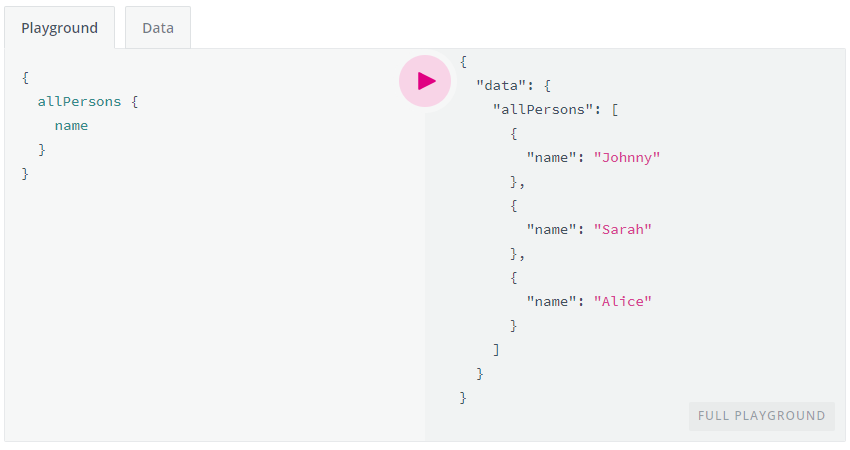

服务端数据为：

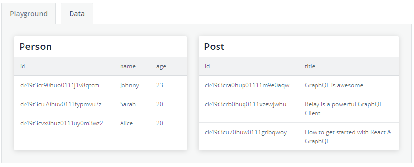

查询中`allPerson`字段称之为查询的根字段，多有根字段里面的字段称之为查询的载荷（payload）。例子中的查询的载荷只有一个字段`name`。

查询返回了所有人的名字列表，注意返回的列表中国只有`name`字段，而没有`age`字段，这是因为查询中只指定了需要`name`字段。如果客户端需要`age`字段，所有需要做的稍微调整一些查询把`age`字段放到查询的载荷中：

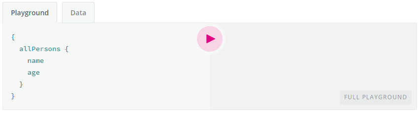

2. #### 带参数查询


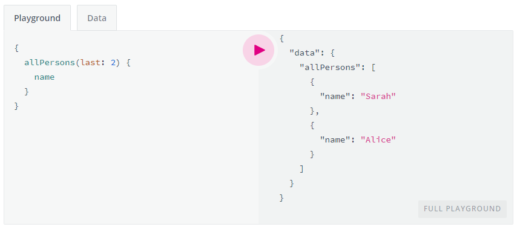

查询返回最后的两个名字。

### 2.3 用Mutations写数据

对数据的改变称之为Mutation，通常的mutation有增、删、改三种。

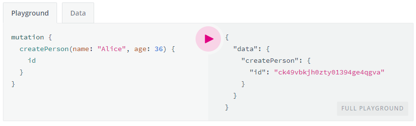

### 2.4 通过Subscription实时更新

当今应用程序的一个重要要求是与服务器建立实时连接，以便立即了解重要事件。对此，GraphGL提供了订阅的概念。

当客户端订阅一个事件，它将启动并保持与服务器的稳定连接。每当实际的事件发生时，服务器就会推送对应的数据到客户端。与遵循典型的“`请求`-`响应`-`周期`”的Queries和Mutations不同，Subscriptions表示发送到客户端的数据流。

订阅使用和Queries、Mutations类似的语法。

```typescript
subscription {
  newPerson {
    name
    age
  }
}
```

在客户端向server发起订阅后，它们之间会打开一个连接。当一个新的创建`Person`的mutation执行后，服务器将会发送关于这个人的信息给客户端：

```
{
  "newPerson": {
    "name": "Jane",
    "age": 23
  }
}
```

### 2.5 定义一个Schema

有了queries、mutations和subscriptions，我们还需要编写一个schema来把这些元素整合起来。schema是GraphQL的重要概念，它指定API的功能，并定义客户端如何请求数据，通常被看作是客户端和服务端之间的合约。

通常，一个schema是GraphGL类型的集合。但是，在为API编写架构时，有一些特殊的跟类型：

```
type Query { ... }
type Mutation { ... }
type Subscription { ... }
```

上面这三个类型时客户端发起请求的入口（entry points）。为了启用我们之前看到的allPersons查询，Query类型需写成下面的样子：

```
type Query {
  allPersons(last: Int): [Person!]!
}
```

同样的，`createPerson` mutation，我们需要将跟字段加入到Mutilation类型中：

```
type Mutation {
  createPerson(name: String!, age: Int!): Person!
}
```

最后，对于订阅，我们也需要添加根字段`newPerson`：

```
type Subscription {
  newPerson: Person!
}
```

最后，我们把它们合在一块，这构成了完整的schema：

```
type Query {
  allPersons(last: Int): [Person!]!
}

type Mutation {
  createPerson(name: String!, age: Int!): Person!
}

type Subscription {
  newPerson: Person!
}

type Person {
  name: String!
  age: Int!
  posts: [Post!]!
}

type Post {
  title: String!
  author: Person!
}
```

## 3. 架构Architecture

### 3.1 用例

在本节中，我们将带您了解3种不同的架构，其中包括GraphQL服务器。

1. ###  具有连接数据库的GraphQL服务器


对于新建项目，这种架构将是最常见的。

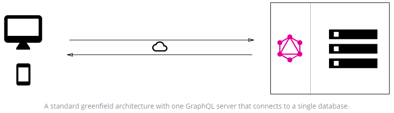

在上面示例的应用场景中，您具有实现了GraphQL规范的单个（Web）服务器。当查询到达GraphQL服务器时，该服务器读取查询的有效负载并从数据库中获取所需的信息。这称为*resolving*查询。然后按照官方规范中的描述构造响应对象，并将其返回给客户端。

请务必注意，GraphQL实际上与传输层无关。这意味着它可以与任何可用的网络协议一起使用。因此，有可能实现基于TCP，WebSockets等的GraphQL服务器。

GraphQL也不关心数据库或用于存储数据的格式。您可以使用SQL数据库（例如AWS Aurora）或NoSQL数据库（例如MongoDB）。

2. ###  集成现有系统的GraphQL层


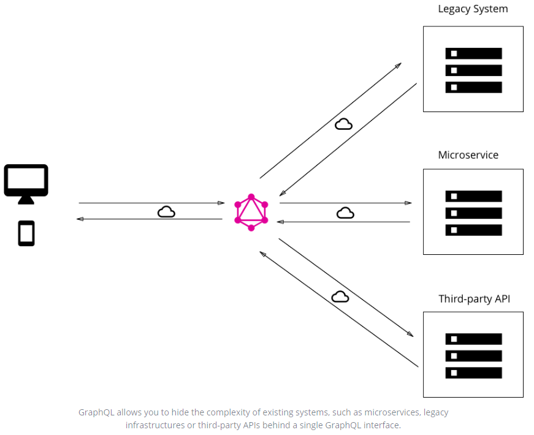

GraphQL的另一个主要用例是在单个一致的GraphQL API之后集成多个现有系统。对于拥有传统基础架构和许多不同API的公司而言，这尤其引人注目，这些公司已经发展了许多年，现在却承担了很高的维护负担。这些遗留系统的一个主要问题是，它们实际上使构建需要访问多个系统的创新产品成为不可能。

在这种情况下，可以使用GraphQL统一这些现有系统，并将它们的复杂性隐藏在一个不错的GraphQL API后面。这样，可以开发新的客户端应用程序，这些应用程序仅与GraphQL服务器对话即可获取所需的数据。然后，GraphQL服务器负责从现有系统中获取数据，并将其打包为GraphQL响应格式。

就像以前的GraphQL服务器不在乎所使用的数据库类型的体系结构一样，这次它不在乎需要获取解决查询所需数据的数据源。

3. ### 连接数据库和现有系统集成的混合方法


服务器收到查询后，它将解析该查询，并从连接的数据库或某些集成的API中检索所需的数据。

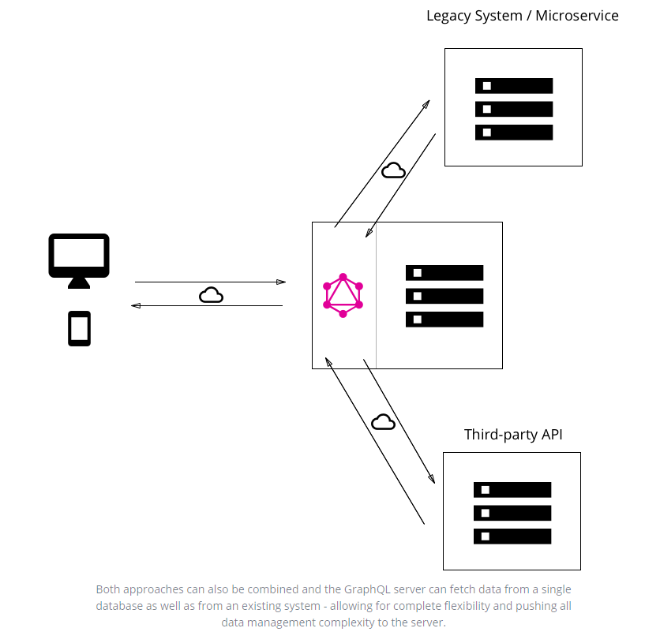

### 3.2 Resolver函数

Resolver唯一目的是为请求的字段获取数据。

服务器收到查询后，它将调用查询payload中指定的字段的所有函数。因此，它解决了查询问题，并且能够为每个字段检索正确的数据。一旦所有resolvers返回，服务器将以查询描述的格式打包数据，并将其发送回客户端。

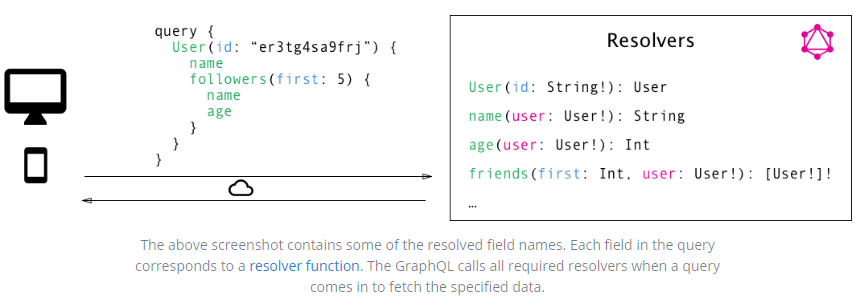

### 3.3 GraphQL客户端库

GraphQL特别适合前端开发人员，因为它完全消除了REST API所遇到的许多不便和缺点，例如超取和欠取。复杂性被推到服务器端，功能强大的机器可以处理繁重的计算工作。客户不必知道其获取的数据实际上是从哪里来的，并且可以使用单个，一致且灵活的API。

让我们考虑一下GraphQL所带来的主要变化，即从一种命令式的数据获取方法转变为一种纯粹的声明式方法。从REST API提取数据时，大多数应用程序将必须执行以下步骤：

1. 构造并发送HTTP请求（例如，使用JavaScript进行抓取）
2. 接收并解析服务器响应
3. 本地存储数据（仅存储在内存中或持久存储）
4. 在用户界面中显示数据

采用理想的声明式数据获取方法，客户只需要执行以下两个步骤：

1. 描述数据规格
2. 在UI中显示数据

所有底层的网络任务以及存储数据都应被抽象化，数据依赖的声明应成为主要部分。

这正是GraphQL客户端库（例如Relay或Apollo）将使您能够执行的操作。它们提供了一种抽象，您需要能够专注于应用程序的重要部分，而不必处理基础结构的重复实现。

